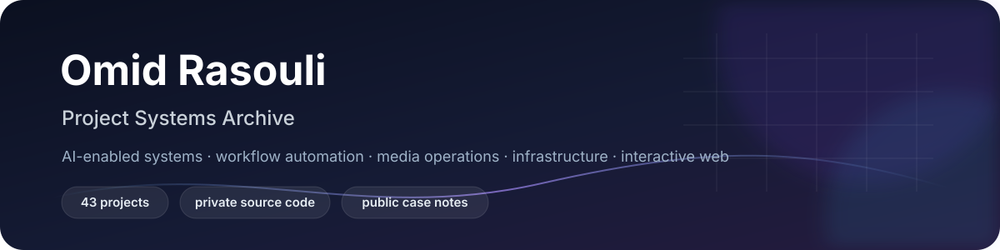

  

  <strong>Products, systems, prototypes and infrastructure I have built or materially worked on.</strong> 
  Public documentation only — source code and sensitive implementation details stay private.

  <a href="https://byomid.com"><strong>byomid.com</strong></a>
  &nbsp;·&nbsp;
  <a href="PROJECTS.md"><strong>Full Project Archive</strong></a>

---

## Featured Systems

<table>
<tr>
<td width="50%" valign="top">

### CortexIS
AI-assisted neuroscience knowledge, retrieval, reporting and controlled workflow platform. Includes semantic knowledge preparation, case-oriented workflows and a patient-facing interaction layer.

**Area:** AI · Knowledge Systems · Workflow

</td>
<td width="50%" valign="top">

### AirtimeForge
Broadcast workflow automation platform covering media inspection, exact timing, catalog/import flows, matching, settings and operational workflows.

**Area:** Broadcast · Automation · Operations

</td>
</tr>
<tr>
<td width="50%" valign="top">

### HamPhone
B2B marketplace for mobile-device shops with listings, discovery, alerts and business-promotion workflows.

**Area:** Marketplace · B2B · Product

</td>
<td width="50%" valign="top">

### WhatsApp Business Agent
Conversation capture, lead qualification, structured intake, follow-up rules, opt-out handling and human handoff.

**Area:** Messaging · Automation · CRM

</td>
</tr>
<tr>
<td width="50%" valign="top">

### Site Builder / Landing Factory
Automated website provisioning from structured customer input, connecting intake, site creation, deployment and handoff.

**Area:** Web Automation · Provisioning · Delivery

</td>
<td width="50%" valign="top">

### C-Lines
Multi-channel broadcast playlist production, scheduling, control and publishing platform for operational broadcast workflows.

**Area:** Media · Scheduling · Control Systems

</td>
</tr>
</table>

---

## Project Map

| Area | Projects | Examples |
|---|---:|---|
| **AI & Intelligent Workflows** | **14** | CortexIS, QEEG Knowledge Builder, AirtimeForge, WhatsApp Agent, CRM systems, WordPress Agent |
| **Broadcast & Media Operations** | **6** | C-Lines, Broadcast Monitoring, Gaming Replay, Digital Signage, Dynamic Ads, Movie Tag Cleaner |
| **Marketplaces & Business Products** | **7** | HamPhone, Kids Clothing Marketplace, International Purchase Platform, Qmark Studio |
| **Interactive Web & 3D** | **9** | Omid Market 3D, Luxury Store, 3D Beauty Salon, Scroll Journey, Reusable 3D Framework |
| **Infrastructure & Delivery** | **5** | Restricted Egress, Iran-Resilient Hosting, Multi-Site Connectivity, Provisioning Pipeline |
| **Private / Experimental** | **2** | OmidData, CrushApp |

**43 documented projects in total.**

[**Browse the complete project-by-project archive →**](PROJECTS.md)

---

## Selected Project Index

### AI, Knowledge & Automation
`CortexIS Core` · `CortexIS Patient App` · `QEEG Brainmap Platform` · `QEEG Knowledge Builder` · `AirtimeForge` · `WhatsApp Business Agent` · `Site Builder` · `Custom CRM Systems` · `WordPress by Omid` · `MCP WordPress / WP Agent` · `Apparel Lead Discovery` · `Instagram Album Importer` · `Veydic` · `CRM UI-First Prototyping`

### Broadcast, Media & Operations
`C-Lines` · `Broadcast Monitoring` · `Gaming Lounge Replay` · `Digital Signage` · `Dynamic Ads / Lower-Third` · `Movie Tag Cleaner`

### Marketplaces & Business Products
`HamPhone` · `Kids Clothing Marketplace` · `International Purchase Platform` · `QMARKETING / Q-Markets` · `Q Club` · `Qma Kids` · `Qmark Studio`

### Interactive Web & 3D
`Omid Market 3D` · `Luxury Interactive Store` · `3D Beauty Salon` · `Personal 3D Studio Site` · `By Omid Portfolio System` · `Scroll Journey / 3D Portfolio` · `Hamid Ebrahimnia 3D Redesign` · `3D Product / Brand Experience` · `Reusable 3D Website Framework`

### Infrastructure & Delivery
`Restricted-Egress Infrastructure` · `Iran-Resilient Web Hosting` · `Multi-Site Remote Connectivity` · `Hosting & Provisioning Pipeline` · `Automated Website Delivery Pipeline`

---

## How the Archive Is Published

The public GitHub profile is intentionally separated from the implementation repositories. Project pages describe the product, problem space and high-level system scope, while the following stay private:

- source code and private repositories
- customer and business data
- credentials, tokens, keys and server addresses
- sensitive network topology and security configuration
- proprietary prompts, internal rules and implementation logic
- confidential project documentation

Project dates are not artificially backfilled. If an original date is not documented with confidence, the archive leaves it out instead of presenting the GitHub upload date as the build date.

---

  <strong>Full archive:</strong> <a href="PROJECTS.md">PROJECTS.md</a> &nbsp;·&nbsp; <strong>Website:</strong> <a href="https://byomid.com">byomid.com</a>

